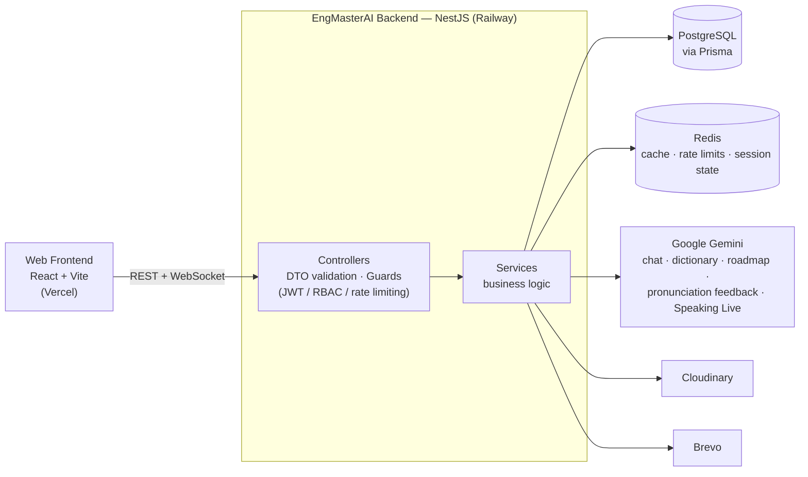
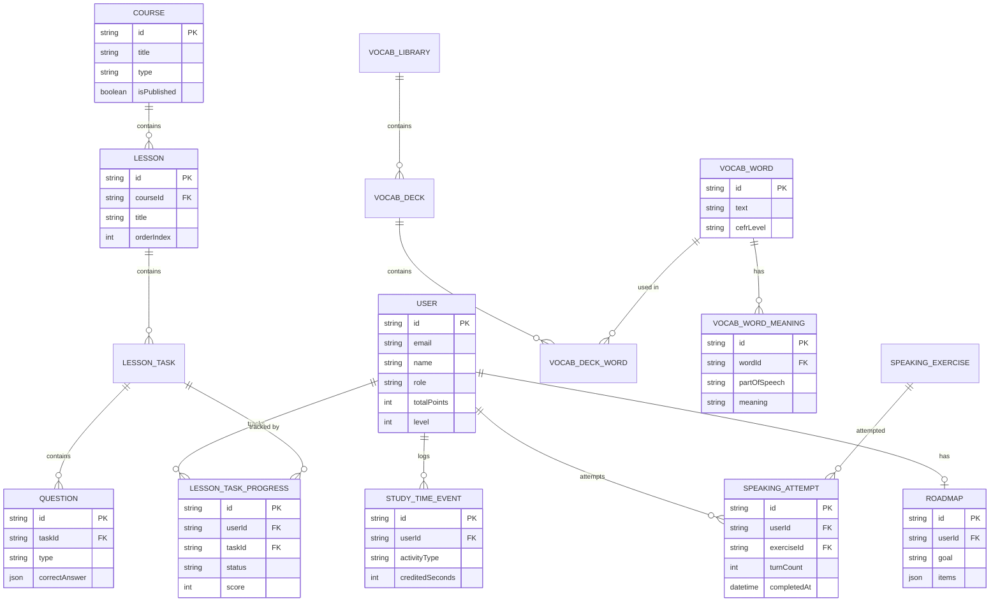
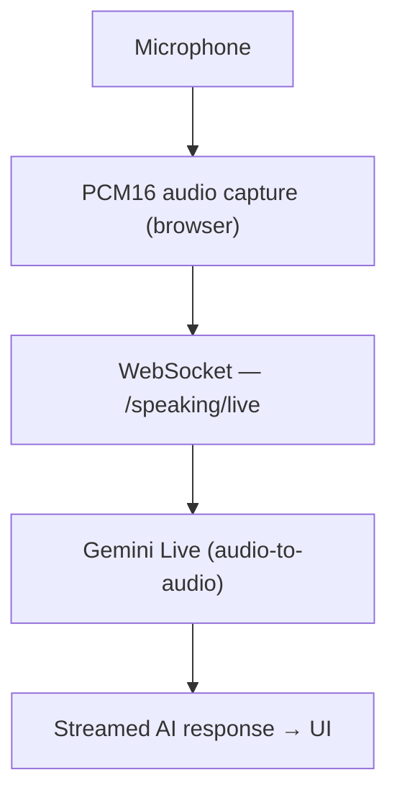

# EngMasterAI Backend

Production-oriented backend for **EngMasterAI**, an AI-powered English
learning platform that provides personalized learning paths, interactive
lessons, AI speaking practice, vocabulary learning with spaced repetition,
listening practice, and an AI-assisted learning workflow.

The backend owns authentication, learning progress, content management,
gamification, AI integrations, real-time speaking sessions, and analytics
for both learners and admins.

> This is not a CRUD demo. It's a modular NestJS system with JWT auth,
> role-based access control, PostgreSQL/Prisma, Redis-backed caching and
> rate limiting, five distinct Google Gemini integrations (including a
> real-time voice pipeline), 100+ automated tests, and a GitHub Actions
> CI pipeline gating every push.

## Key Features

- JWT authentication with **rotating refresh tokens** (Redis-backed, atomic Lua rotation)
- Role-based access control (RBAC) enforced across every admin-facing endpoint
- RESTful API built with NestJS, DTO-validated on every request
- PostgreSQL with Prisma ORM (39 models across 10+ learning domains)
- Redis for caching, atomic rate limiting, and short-lived session state
- **Five** Google Gemini integrations: AI chat assistant, real-time voice
  speaking practice, dictionary translation, pronunciation feedback, and
  AI-narrated learning roadmaps
- Personalized learning roadmap generated from a placement test
- Vocabulary learning with a spaced-repetition system (SRS)
- Listening practice (dictation scoring + AI shadowing) and speaking
  practice (scripted scenarios + real-time voice conversation)
- Gamification: XP, level curve, daily streaks, achievements
- 100+ automated unit, integration, and end-to-end test files
- Docker Compose for local development; Railway for production
- CI/CD via GitHub Actions — build and the full test suite gate every push

## System Architecture

EngMasterAI follows a modular, domain-oriented backend architecture built
with NestJS.



### Architectural Principles

- Modular, domain-oriented modules (auth, learning, speaking, dictionary, …)
- Controllers stay thin; business logic lives in services
- DTO-based request validation via a global `ValidationPipe`
- Guards for authentication, RBAC, and per-feature rate limiting
- All database access goes through Prisma — no raw SQL in application code
- Redis for anything short-lived: rate-limit counters, refresh-token
  rotation state, cached dictionary lookups, bounded chat/speaking history
- External AI calls are isolated behind dedicated `Gemini*Provider` classes,
  each independently mockable in tests and individually feature-flagged —
  a missing API key degrades one feature instead of failing app boot

## Tech Stack

### Backend
- NestJS 11, TypeScript
- Prisma ORM 6
- REST API + a `ws`-based WebSocket gateway (Speaking Live)

### Database
- PostgreSQL
- Redis (ioredis)

### AI
- Google Gemini (`@google/genai`) — chat, dictionary translation,
  roadmap narration, pronunciation feedback, and Gemini Live (real-time
  voice)

### Authentication
- JWT access tokens + rotating refresh tokens
- Google Sign-In (ID-token verification)
- Role-Based Access Control (RBAC)
- `argon2` password hashing

### Infrastructure
- Docker Compose (local Postgres + Redis)
- Railway (production build + deploy, Railpack builder)
- GitHub Actions (CI)
- Cloudinary (media storage) · Brevo (transactional email)

### Testing
- Jest, Supertest
- Unit, integration, and end-to-end tests (107 spec files)

Keywords this stack actually covers: Node.js, TypeScript, NestJS, REST API,
WebSocket, PostgreSQL, Prisma, Redis, JWT, RBAC, Docker, GitHub Actions,
CI/CD, Jest, Supertest, E2E testing, Gemini API.

## Core Modules

| Module | Responsibility |
|---|---|
| Auth | Registration, login, JWT + rotating refresh tokens, Google Sign-In, email verification, password reset |
| User | Profiles and role-scoped account management |
| Course / Lesson | Course and lesson authoring, quizzes, practice, trap-hunter drills, step/stage progress |
| Vocabulary | Vocabulary libraries, decks, words, and a CSV/Excel/JSON import pipeline |
| Learning | Spaced-repetition scheduling, per-user learning dashboard, timezone-aware progress windows |
| Listening | Listening content catalog, dictation scoring, AI-scored shadowing (speech-to-text + pronunciation feedback) |
| Speaking | Scenario-based practice, real-time Speaking Partner (Gemini Live), subtitle translation |
| Dictionary | 3-tier word lookup: curated data → Redis cache → external API + AI translation |
| Chat | "Engy" — the in-app AI learning assistant (multi-turn, Redis-bounded history) |
| Placement | Initial English level assessment and AI-narrated personalized roadmap |
| Gamification | XP, level curve, daily streaks, achievements |
| Study Time | Credited study-time tracking used by dashboards and leaderboards |
| Analytics | Per-user and admin-wide learning/engagement dashboards |
| Health | Liveness/readiness endpoints consumed by Railway's health check |

Admin-only capabilities are not a separate module — they're role-gated
routes (`@Roles(UserRole.ADMIN)` + a shared `RolesGuard`) spread across the
modules above (Users, Courses, Vocabulary, Listening, Placement, Speaking,
Analytics), so admin management stays next to the domain it manages.

## Database Architecture

PostgreSQL via Prisma ORM — **39 models, 23 enums** across the domains
above. Core relationships, with real field names from `prisma/schema.prisma`
(trimmed to what matters for the shape of the domain, not a full column dump):



Every migration is version-controlled under `prisma/migrations` and
applied via `prisma migrate deploy` — in CI, in local dev, and as a
pre-deploy step on Railway.

## Authentication & Authorization

- Short-lived JWT access tokens (`Authorization: Bearer`)
- Long-lived refresh tokens stored in Redis and delivered as an
  **httpOnly cookie**, rotated on every use via an atomic Lua script
  (prevents a race where a stolen/replayed token could be redeemed twice)
- Role-based authorization via a `@Roles()` decorator + `RolesGuard`
- DTO validation on every request (`class-validator` + a global `ValidationPipe`)
- Environment validation at boot (Joi) — a missing/malformed required
  variable fails startup instead of degrading silently at request time
- Optional integrations (Google Sign-In, email, every Gemini feature)
  are off by default and **fail closed**: the app boots and the rest of
  the API works normally even with zero AI/email/OAuth configuration

### Cross-Origin Authentication

The frontend (Vercel) and backend (Railway) are intentionally deployed on
separate origins, so cookie-based auth needs explicit cross-origin
handling:

- `SameSite=None` + `Secure` cookies in production (`lax` + non-secure in
  dev, matching plain `http://localhost`)
- An explicit `CORS_ALLOWED_ORIGINS` allowlist, validated at boot — never
  a wildcard, since credentials are always enabled
- A dedicated `TrustedOriginGuard` on the two endpoints that authenticate
  by cookie alone (`POST /auth/refresh`, `POST /auth/logout`) — CORS alone
  doesn't stop a forged cross-site request from *sending* the cookie, so
  this guard checks the `Origin` header against the same allowlist CORS
  uses, keeping exactly one definition of "trusted origin"

## AI Integration

EngMasterAI integrates Google Gemini into five distinct workflows, each
behind its own provider class and feature flag:

- **Chat** — "Engy", a multi-turn AI learning assistant scoped to
  grammar/vocab help and study guidance (Redis-bounded history, no
  persisted transcript)
- **Dictionary translation** — the Vietnamese line for externally-sourced
  lookups only; the English definition itself always comes from a real
  dictionary source, never generated
- **Roadmap narration** — a one-time orientation paragraph on top of a
  deterministic, non-AI placement roadmap, cached after first generation
- **Pronunciation feedback** — a second, opt-in Gemini call over a
  shadowing recording; the audio is processed and discarded, only the
  resulting text is stored
- **Speaking Live** — real-time, audio-to-audio voice conversation

### Speaking Live

The Speaking Partner module supports real-time voice conversation with
Gemini over a persistent WebSocket, replacing an older
record-transcribe-reply pipeline entirely:



Only the aggregate turn count is persisted to Postgres; the turn-by-turn
transcript lives in Redis with a sliding TTL, matching the same
ephemeral-by-default pattern as Engy Chat.

## Caching & Performance

Redis is used for short-lived and frequently accessed data, to avoid
repeated database and external API calls:

- **Refresh-token rotation** — atomic, Lua-scripted (`rotate-refresh-token.lua`)
- **Auth rate limiting** — atomic fixed-window counters (`rate-limit-incr.lua`)
  on login, register, refresh, Google Sign-In, and email-verification/
  password-reset endpoints
- **Per-feature rate limiting** — dedicated guards for learning, chat,
  speaking, dictionary, and quiz endpoints
- **Dictionary lookup caching** — tier 2 of a 3-tier lookup (curated data →
  Redis, 30-day TTL → external API), so a popular word is looked up
  externally once
- **Bounded session state** — Engy Chat and Speaking Live both keep a
  sliding-TTL, size-bounded history in Redis instead of a Postgres table,
  since neither needs to survive past the session

## API Overview

### Authentication
```
POST /auth/register
POST /auth/login
POST /auth/refresh
POST /auth/logout
POST /auth/google
POST /auth/google/link
```

### Courses & Lessons
```
GET   /courses
GET   /courses/:id
GET   /courses/:courseId/lessons
GET   /lessons/:lessonId/quiz
GET   /lessons/:lessonId/practice
GET   /lessons/:lessonId/steps
GET   /progress
```

### Vocabulary
```
GET  /vocab/libraries
GET  /vocab/decks
GET  /vocab/words
```

### Listening & Speaking
```
GET  /listening
GET  /speaking/scenarios
POST /speaking/exercises/:exerciseId/attempts
WS   /speaking/live
POST /speaking/translate
```

### Dictionary & Chat
```
GET  /dictionary/lookup
GET  /dictionary/suggestions
POST /chat/messages
GET  /chat/session
```

### Placement, Gamification & Analytics
```
GET  /placement
GET  /gamification
GET  /analytics/dashboard
GET  /analytics/admin-dashboard
```

### Health
```
GET  /health/live
GET  /health/ready
```

No OpenAPI/Swagger UI is wired up yet — see Future Improvements.

## Security

Beyond the JWT/RBAC/cookie design above:

- Global `ValidationPipe` rejects any request body that doesn't match its DTO
- `TRUST_PROXY` is explicit and off by default — every rate limit reads
  `req.ip`, never a hand-parsed `X-Forwarded-For` header, so it can't be
  spoofed by a client claiming to be behind a proxy that isn't there
- Passwords are hashed with `argon2`, never stored or logged in plaintext
- All secrets (JWT secret, DB URL, Gemini/Cloudinary/Brevo keys) are
  environment-only — nothing is checked into the repository
- Request-ID correlation middleware and structured auth-event logging for
  security-relevant events (login, refresh, lockout)
- Database access is exclusively through Prisma's parameterized queries —
  no raw SQL string building in application code

## Testing

The backend uses Jest and Supertest for automated testing.

```bash
npm test          # unit + integration
npm run test:cov  # with coverage
npm run test:e2e  # end-to-end
```

**107 test files** — 82 unit/integration specs and 25 end-to-end specs —
covering authentication, learning progress, vocabulary, listening,
speaking, dictionary, gamification, and placement/roadmap logic. Several
"unit" specs are really integration tests: they run against a real
Postgres + Redis via a guarded test-database bootstrap that refuses to
run unless the target database name ends in `_test`, after a fixture leak
into a development database during earlier development.

## CI/CD

GitHub Actions runs on every push and pull request to `main`:

```text
checkout
   │
   ▼
setup Node (pinned to package.json "engines")
   │
   ▼
npm ci
   │
   ▼
prisma generate
   │
   ▼
build
   │
   ▼
lint (non-blocking — pre-existing debt, tracked separately)
   │
   ▼
unit + integration tests
   │
   ▼
end-to-end tests
```

Postgres 13.5 and Redis 7-alpine run as real GitHub Actions service
containers for the job — the same versions `docker-compose.yml` uses
locally. `build`, `test`, and `test:e2e` are hard, non-negotiable gates;
only the lint step is `continue-on-error`.

## Environment Variables

Copy `.env.example` to `.env` and fill in real values — it is the single
source of truth for every variable the app reads.

```env
# Core
DATABASE_URL=
PORT=3000
CORS_ALLOWED_ORIGINS=

# JWT & Redis
JWT_SECRET=
REFRESH_TOKEN_TTL_SECONDS=2592000
REDIS_HOST=
REDIS_PORT=

# Optional — Google Sign-In (app boots fine without it)
GOOGLE_AUTH_ENABLED=false
GOOGLE_CLIENT_ID=

# Optional — Transactional email (Brevo)
EMAIL_ENABLED=false
EMAIL_PROVIDER_API_KEY=

# Optional — Media storage
CLOUDINARY_CLOUD_NAME=
CLOUDINARY_API_KEY=
CLOUDINARY_API_SECRET=

# Optional — Google Gemini (shared across chat, dictionary,
# roadmap narration, shadowing feedback, and Speaking Live)
GEMINI_API_KEY=
```

Never commit real secrets to the repository — `.env` is gitignored, and
every optional integration above fails closed (reports itself
unavailable) rather than crashing the app when its key is unset.

## Local Development

### Requirements
- Node.js 22.x (pinned via `package.json` → `engines`)
- PostgreSQL
- Redis
- Docker (recommended, for local Postgres/Redis via Compose)

### Installation

```bash
git clone https://github.com/TCoder4k/engmasterai-backend.git
cd engmasterai-backend

npm install
docker compose up -d          # local Postgres + Redis
cp .env.example .env          # fill in real values
cp .env.test.example .env.test

npx prisma generate
npx prisma migrate deploy

npm run start:dev
```

The API is available at `http://localhost:3000`.

## Production Deployment

The backend is deployed to **Railway**:

- Build: `npx prisma generate && npm run build` (Railpack builder — no
  Dockerfile in production; Docker Compose above is local-dev only)
- Pre-deploy: `npx prisma migrate deploy`
- Start: `npm run start:prod`
- Health check: `GET /health/ready`, restart on failure (up to 10 retries)

The frontend is deployed separately to **Vercel** — see
[Cross-Origin Authentication](#cross-origin-authentication) for how the
two intentionally-separate origins share an authenticated session.

## Project Structure

```text
src/
├── auth/                  # JWT, refresh rotation, RBAC, Google Sign-In, rate limiting
├── user/
├── course/
├── lesson/                # + quiz/, progress/, steps/ sub-domains
├── vocab-library/
├── vocab-deck/
├── vocab-word/
├── vocab-import/          # CSV/Excel/JSON vocabulary import pipeline
├── learning/              # SRS scheduler, per-user dashboard, timezone utils
├── listening/             # + dictation/, shadowing/ (Gemini STT + feedback)
├── speaking/              # + live/ (Gemini Live), rate-limit/
├── dictionary/            # + rate-limit/
├── chat/                  # "Engy" AI assistant + rate-limit/
├── placement/             # + roadmap/ (AI-narrated roadmap)
├── gamification/
├── study-time/
├── analytics/
├── health/
├── mail/                  # Brevo transactional email
├── shared/                # Redis module, Cloudinary provider, cross-cutting utils
├── prisma/
├── production-bootstrap/  # safe, idempotent production content seeding
├── app.module.ts
└── main.ts

test/                      # end-to-end specs (25 files)
prisma/                    # schema + migrations
```

## Engineering Decisions

### Why NestJS?
NestJS's modular architecture, dependency injection, guards, and strong
TypeScript support fit a platform with 15+ largely-independent domains
(auth, learning, speaking, vocabulary, gamification, …) that still need
to share cross-cutting concerns like auth guards and validation.

### Why PostgreSQL + Prisma?
Learning progress, course/lesson hierarchies, and gamification state are
inherently relational and need transactional consistency. Prisma gives
type-safe queries and an explicit, version-controlled schema without
hand-written SQL.

### Why Redis?
Redis holds everything that's short-lived or doesn't need Postgres's
durability guarantees: rate-limit counters, refresh-token rotation state,
cached dictionary lookups, and bounded chat/speaking transcripts. Rate
limiting and refresh rotation specifically need atomicity under
concurrent requests, which is why both are implemented as Lua scripts
rather than a read-then-write round trip from application code.

### Why isolate AI behind provider classes?
Every Gemini call goes through a dedicated `Gemini*Provider`
(`GeminiEngyChatProvider`, `GeminiSpeakingLiveConnectionProvider`, …).
Each one is independently mockable in tests, individually feature-flagged,
and fails closed — a missing or invalid API key degrades exactly one
feature instead of failing application boot.

## Challenges & Solutions

### Real-time AI speaking practice
**Problem:** A traditional record → upload → transcribe → reply loop adds
multiple seconds of round-trip latency per turn, which doesn't feel like
a conversation.
**Solution:** Replaced it with a persistent WebSocket (`/speaking/live`)
streaming PCM16 audio directly to Gemini Live, which responds with
audio-to-audio in real time.

### Cross-origin, cookie-based authentication
**Problem:** Frontend (Vercel) and backend (Railway) run on different
origins, and CORS alone doesn't stop a forged cross-site request from
sending an existing cookie.
**Solution:** `SameSite=None` + `Secure` refresh cookies, plus a
`TrustedOriginGuard` that explicitly checks the `Origin` header against
the same allowlist CORS uses, on the two endpoints that authenticate by
cookie alone.

### A hanging end-to-end test run
**Problem:** The full e2e suite started hanging *after* every test had
already passed, with no error — nothing to bisect from a stack trace.
**Solution:** Root-caused by bisecting down to a 2-file minimal repro.
Two separate leaks, both silent: `PrismaService` and the shared Redis
module never released their connections on shutdown (no
`OnModuleDestroy`), and one e2e file built a fresh Nest app in
`beforeEach` with no matching `afterEach`. Fixing both let the full suite
exit cleanly with code 0.

## Future Improvements

- OpenAPI/Swagger documentation for the REST API
- User retention/churn analytics (needs a `lastLoginAt`/`deletedAt`
  signal that doesn't exist on `User` yet)
- Parallel e2e execution — currently serial (`maxWorkers: 1`) because
  multiple e2e files share one Postgres test database; needs real
  cross-suite fixture isolation first
- Clear the pre-existing lint/formatting debt currently keeping the CI
  lint step non-blocking

## Related Repositories

- Backend: [github.com/TCoder4k/engmasterai-backend](https://github.com/TCoder4k/engmasterai-backend)
- Frontend: [github.com/TCoder4k/engmasterai-frontend](https://github.com/TCoder4k/engmasterai-frontend)

## Author

**TCoder4k**
Full-stack developer — TypeScript, NestJS, React.

- GitHub: [@TCoder4k](https://github.com/TCoder4k)
